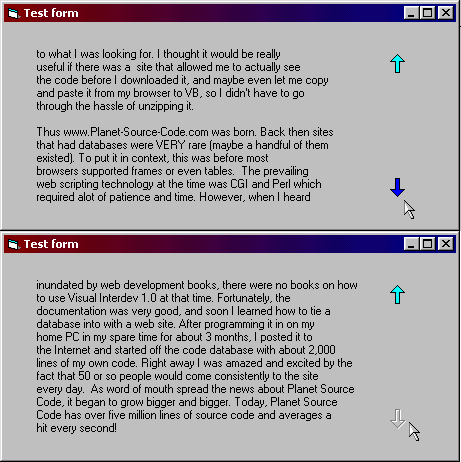



## \[ New\!: ScrollingLabel usercontrol \]

### Description

It's not another "scroll text in a label" code. He can scroll WHOLE label with text within. Ready-to-use and easy-to-understand user control project. Check the screenshot and see how it works. Just put ScrollingLabel into your form, add dozens of text, set scrolling interval and enjoy :) It has nice arrows (scrolling (up or down): starded, could be continued, not possible), plus fully customized properties: BackColor, BorderStyle, Font, ForeColor, ScrollingInterval. If you like this user control please vote. Thanks :)
 
### More Info
 

             |
---                |---
**Submitted On**   |2003-06-29 13:26:32
**By**             |[PRzEm](https://github.com/Planet-Source-Code/PSCIndex/blob/master/ByAuthor/przem.md)
**Level**          |Intermediate
**User Rating**    |4.6 (51 globes from 11 users)
**Compatibility**  |VB 4\.0 \(32\-bit\), VB 5\.0, VB 6\.0
**Category**       |[Custom Controls/ Forms/  Menus](https://github.com/Planet-Source-Code/PSCIndex/blob/master/ByCategory/custom-controls-forms-menus__1-4.md)
**World**          |[Visual Basic](https://github.com/Planet-Source-Code/PSCIndex/blob/master/ByWorld/visual-basic.md)
**Archive File**   |[\[\_New\!\_\_Sc160810712003\.zip](https://github.com/Planet-Source-Code/przem-new-scrollinglabel-usercontrol__1-46554/archive/master.zip)

